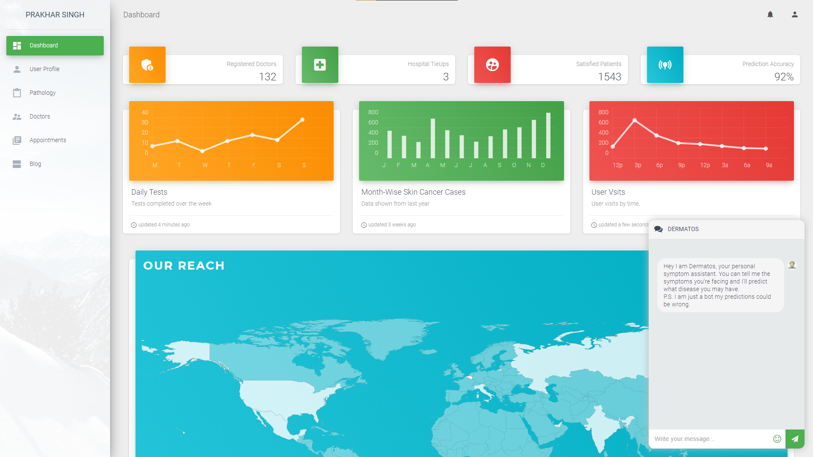

# EPIDERMA Skin Cancer Detection Portal
> We propose a novel method of primary skin cancer prevention that integrates the following features into a cloud based web framework which optimizes the process of cancer detection

>### Objectives 
 >* Design an interactive patient and doctor portal
 >* Provide an e-report generation system using Deep Learning
 >* Assist the doctors in Skin Cancer diagnosis and imaging tasks
 >* Equip the portal with a backend doctor database and a location & filter specific doctor recommendation portal
 >* Add a symptom and disease tagging support system based on NLP

>### Features
  >* Skin Cancer Probability Prediction
  >* Skin Tumor Detection 
  >* Skin Cancer Type Classification
  >* Malignant Probability Prediction
  >* Skin Tumor Size Prediction
  >* DermaDroid Chatbot
  >* Doctor Recommendation System
  >* Report Generation System
  >* Discussion Forum
  >* Remedy Suggestion




## Installation

OS X & Linux:

```sh
 git clone https://github.com/prakharsingh1312/Skin-Cancer-Detection.git SCD
 cd SCD
 virtualenv venv
 source venv/bin/activate
 pip3 install -r requirements.txt
 python3 app.py
```

Windows (Not Recommended as Pytorch has problems in installing):

```sh
git clone https://github.com/prakharsingh1312/Skin-Cancer-Detection.git SCD
cd SCD
virtualenv venv
./venv/Scripts/activate
pip3 install -r requirements.txt
python3 app.py
```

## Meta

> Naman Tuli – Email: namantuli2000@gmail.com -
[GitHub](https://github.com/namantuli18)

> Prakhar Singh – Email: prakharsingh13@gmail.com -
[GitHub](https://github.com/prakharsingh1312)

## Contributing

>1. Fork it (<https://github.com/prakharsingh1312/Skin-Cancer-Detection/fork>)
>2. Create your feature branch (`git checkout -b feature/fooBar`)
>3. Commit your changes (`git commit -am 'Add some fooBar'`)
>4. Push to the branch (`git push origin feature/fooBar`)
>5. Create a new Pull Request

<!-- Markdown link & img dfn's -->
[npm-image]: https://img.shields.io/npm/v/datadog-metrics.svg?style=flat-square
[npm-url]: https://npmjs.org/package/datadog-metrics
[npm-downloads]: https://img.shields.io/npm/dm/datadog-metrics.svg?style=flat-square
[travis-image]: https://img.shields.io/travis/dbader/node-datadog-metrics/master.svg?style=flat-square
[travis-url]: https://travis-ci.org/dbader/node-datadog-metrics
[wiki]: https://github.com/yourname/yourproject/wiki
